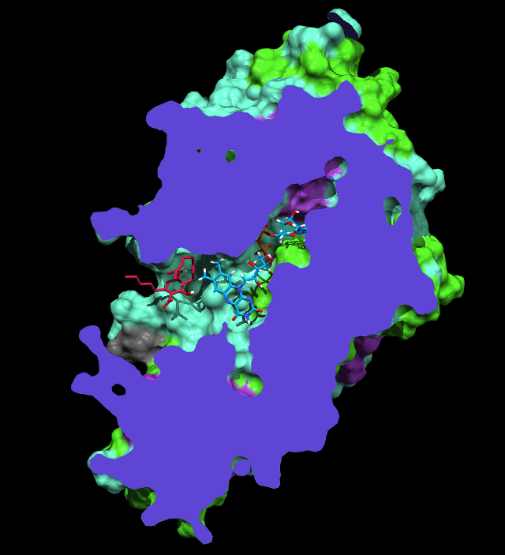
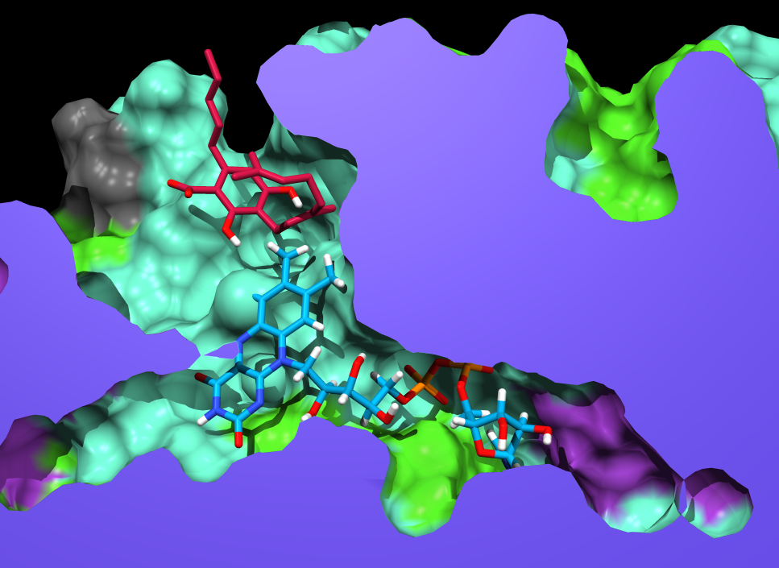
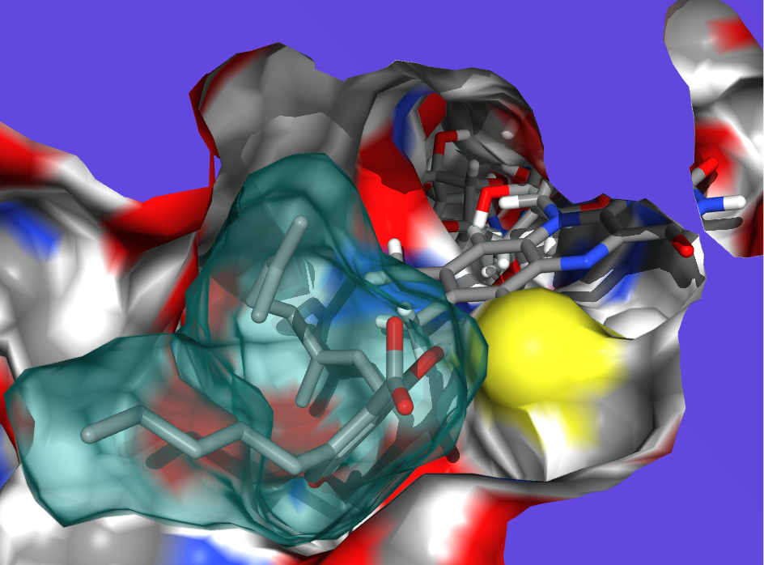
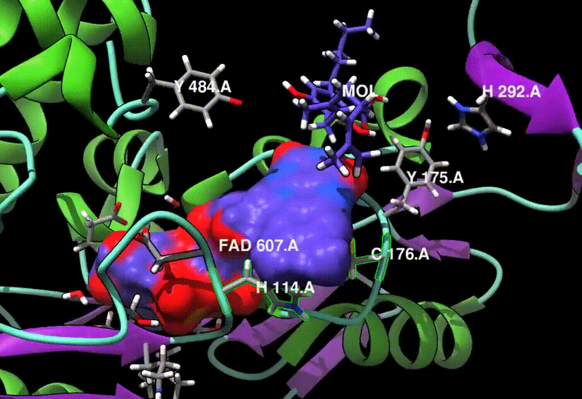

# About
QC/MD simulations of a natural homologue of RCSB PDB identifier 3VTE.

Secondary structure comes from UniProt ID A6P6V9 (~85% identity 3VTE). Tertriatry structure was modelled with SWISS-MODEL ref. 3VTE. 

QC atoms are found in active site residues Y484, H292, FAD, H114, C176, and the substrate MOL.

### Files
#### A6P6V9-asite/
- H292
    - Active site residue
    - Minimized pose w/o substrate
    - Protonated (HID)
- Y484
    - Active site residue
    - Minimized pose w/o substrate
    - Protonated (-OH)
- FHC
    - FAD cofactor
    - Minimized pose w/o substrate
    - Covalent H114, C176
    - Protonated (semiquinone)
- CBGA
    - Substrate
    - Hand placed active pose
    - Protonated (-COOH)
