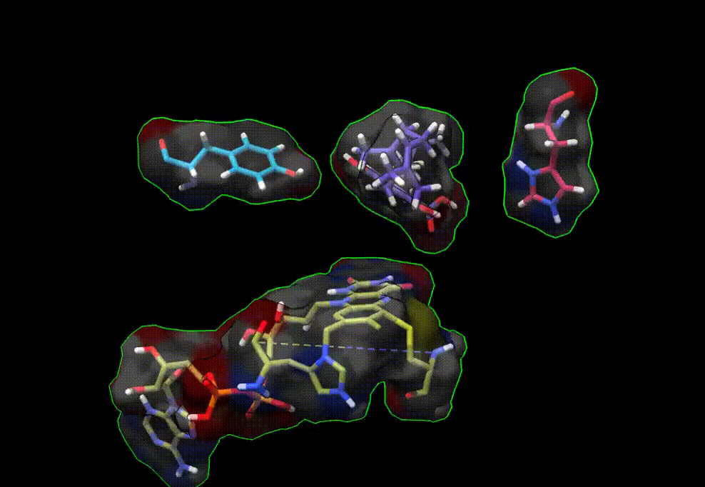

# About
QC/MD simulations of a natural homologue of RCSB PDB identifier 3VTE.

Secondary structure comes from UniProt ID A6P6V9 (~85% identity 3VTE). Tertriatry structure was modelled with SWISS-MODEL ref. 3VTE. 

A slice of the modeled active wite residues is shown below. QC atoms are in active site Y484, H292, FAD, H114, C176, and substrate MOL.

<!--  -->